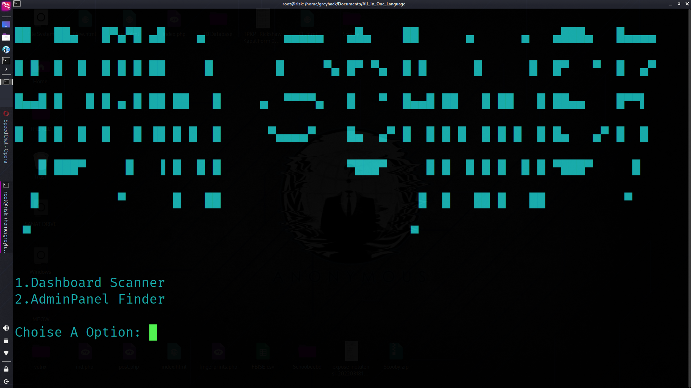

# AdminFinder
Best Website Admin Panel Finder Tool


<p align="center">

</p> 

## Features
 [+] Fast Admin Panel Finder Tool
 [+] Admin Panel Finder And Admin Dashboard Finder
 [+] Easy to install and remove
 [+] More than 1000 potential admin panels


Installation on Gnu / Linux OS. </br>

On terminal </br>


```diff
git clone https://github.com/BharatCyberForce/AdminFinder
```

```diff
cd AdminFinder
```

```diff
pip3 install -r requirements.txt
```

```diff
python3 Main.py
```

</br> </br>

</br> </br>

# DISCLAIMER
This video is just for an Instructive reason. Any activities or potentially exercises identified with the material contained on this YouTube channel is exclusively your responsibility. The abuse of the data on this YouTube divert can bring about criminal allegations brought against the people being referred to. The creators and anonymous pro professional won't be considered capable in the occasion any criminal allegations be brought against any people abusing the data in this anonymous pro genius to violate the law.

## Credits

